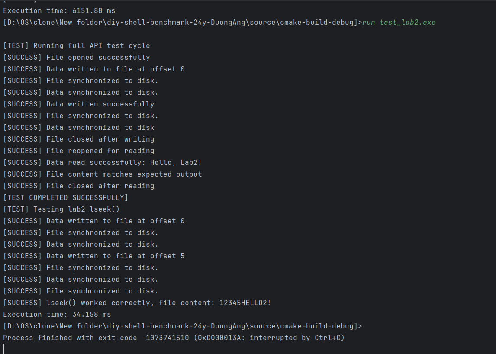
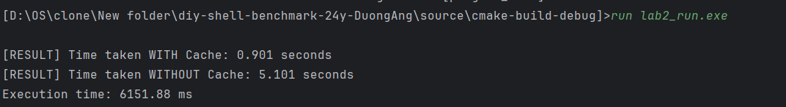

## Операционные системы 
### Лабораторная работа №2
#### Студент: Зыонг Динь Ань Р3307
#### Вариант: Windows Optimal </br>
#### Задание </br>
Для оптимизации работы с блочными устройствами в ОС существует кэш страниц с данными, которыми мы производим операции чтения и записи на диск. Такой кэш позволяет избежать высоких задержек при повторном доступе к данным, так как операция будет выполнена с данными в RAM, а не на диске (вспомним пирамиду памяти).
В данной лабораторной работе необходимо реализовать блочный кэш в пространстве пользователя в виде динамической библиотеки (dll или so). Политику вытеснения страниц и другие элементы задания необходимо получить у преподавателя.

При выполнении работы необходимо реализовать простой API для работы с файлами, предоставляющий пользователю следующие возможности:

Открытие файла по заданному пути файла, доступного для чтения. Процедура возвращает некоторый хэндл на файл. Пример: 

```int lab2_open(const char *path)``` </br>

Закрытие файла по хэндлу. Пример:

```int lab2_close(int fd)```</br>

Чтение данных из файла. Пример:

```ssize_t lab2_read(int fd, void buf[.count], size_t count)```</br>

Запись данных в файл. Пример:

```ssize_t lab2_write(int fd, const void buf[.count], size_t count)```</br>

Перестановка позиции указателя на данные файла. Достаточно поддержать только абсолютные координаты. Пример:

```​​​​​​​off_t lab2_lseek(int fd, off_t offset, int whence)```</br>

Синхронизация данных из кэша с диском. Пример:

```int lab2_fsync(int fd)```</br>

Операции с диском разработанного блочного кеша должны производиться в обход page cache используемой ОС.

В рамках проверки работоспособности разработанного блочного кэша необходимо адаптировать указанную преподавателем программу-загрузчик из ЛР 1, добавив использование кэша. Запустите программу и убедитесь, что она корректно работает. Сравните производительность до и после.

#### Ограничения
Программа (комплекс программ) должна быть реализован на языке C или C++.
Если по выданному варианту задана политика вытеснения Optimal, то необходимо предоставить пользователю возможность подсказать page cache, когда будет совершен следующий доступ к данным. Это можно сделать либо добавив параметр в процедуры read и write (например, ssize_t lab2_read(int fd, void buf[.count], size_t count, access_hint_t hint)), либо добавив еще одну функцию в API (например, int lab2_advice(int fd, off_t offset, access_hint_t hint)). access_hint_t в данном случае – это абсолютное время или временной интервал, по которому разработанное API будет определять время последующего доступа к данным.
Запрещено использовать высокоуровневые абстракции над системными вызовами. Необходимо использовать, в случае Unix, процедуры libc.
#### Результаты работы

Я обновил еще 3 папки в лабораторной работе 1: include, src и test.

[include](https://github.com/DuongAng/OS-lab2/tree/main/source/include)

[src](https://github.com/DuongAng/OS-lab2/tree/main/source/src)

[test](https://github.com/DuongAng/OS-lab2/tree/main/source/test)

Я буду говорить об Optimal Policy.

Optimal Policy выберет для замены страницу с самым отдаленным временем доступа, поскольку она меньше всего нужна в ближайшем будущем.

Сначала я создаю 2 заголовка lab2 и cache. Моя цель состоит в том, чтобы lab2 стала местом хранения API, работающих с файлами, а кэш стал местом применения оптимального метода к оболочке, чтобы увидеть разницу в работе программы.

Как вы видите, это файл lab2.cpp, в котором есть API lab2_open, lab2_close, lab2_read, lab2_write, lab2_lseek и lab2_fsync. Функции API представлены так, как указано в Интернете

Теперь давайте проверим, нормально ли работают API. Это делается через оболочку, которая была создана в Lab1.



Похоже, все API работают нормально.

Теперь сравните результаты с cache и без него.




мы можем увидеть в 5 раз быстрее, это я тестирую с большим количеством циклов, потому что малое количество циклов обычно не имеет значения.

Таким образом, мы видим оптимизацию при использовании кэша при работе с данными и файлами. Однако оптимальную политику сложно применять, поскольку мы не можем предсказать будущее.


#### Вывод

Благодаря выполнению вышеуказанного лабораторного упражнения я лучше ознакомился с использованием C++ для кодирования оболочки и создания кэша с оптимальным методом удаления страниц кэша.
